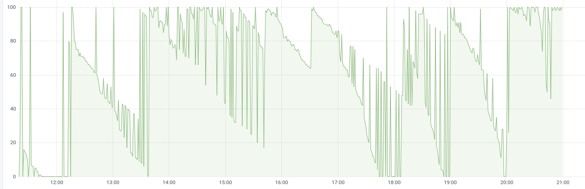

# Deep Dark DockerHub

A simple tool that collects your DockerHub pull ratelimit, then sends it to InfluxDB for visualization.

## Usage

0. Install requirements: `pip3 install influxdb requests datetime --user`
1. Clone this repo.
2. Edit params in `main.py`.
3. Write a crontab to run it regularly.

## Demo

